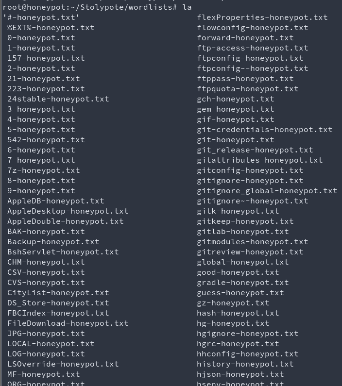

# Stolypote


A stolen/refactored/golang version of laluka's Broneypote https://github.com/laluka/broneypote


-> Even if I've tried to maximize the security, I'm still not responsible for any damage this tool can cause to your network ! It's a honeypot, it's supposed to be attacked and to be a target for malicious actors. Use it at your own risks.

# Installation

-> On a brand new VPS from Digitalovean/Linode/whatever...
-> Isolate it from anything critical from your network !

```bash
# update your ssh port -> don't forget to open it in your firewall
echo "Port 123456" >> /etc/ssh/sshd_config
sudo ufw allow 123456
reboot

# run basic docker install as root
apt update && apt upgrade -y
apt install git ca-certificates curl -y


## Add docker repos (from https://docs.docker.com/engine/install/ubuntu/#install-using-the-repository)

install -m 0755 -d /etc/apt/keyrings
curl -fsSL https://download.docker.com/linux/ubuntu/gpg -o /etc/apt/keyrings/docker.asc
chmod a+r /etc/apt/keyrings/docker.asc

echo \
  "deb [arch=$(dpkg --print-architecture) signed-by=/etc/apt/keyrings/docker.asc] https://download.docker.com/linux/ubuntu  $(. /etc/os-release && echo "${UBUNTU_CODENAME:-$VERSION_CODENAME}") stable" | tee /etc/apt/sources.list.d/docker.list > /dev/null

apt update

apt install -f docker-ce docker-ce-cli containerd.io docker-buildx-plugin docker-compose-plugin

# Consider rebooting the server to make sure everything is working fine

# run as user

git clone https://github.com/ElSicarius/Stolypote
cd Stolypote

# make sure the wordlists are writable by the honeypot
sudo chown -R 100:100 wordlists/
# make sure the dump folder is writable by the honeypot
sudo chown -R 100:100 wordlists/dump/

chmod +x start.sh

```

Then start everything with your domain name and port ranges. Register a DNS record A for any subdomain/domain you like to point to your honeypot, then use

```bash
./start.sh -p "80,443,9999" -d "example.com" -d "subdomain.example.com"

```

```bash
./start.sh -f ports/top1000.txt -d "example.com" -d "subdomain.example.com"

```

```bash
./start.sh -p "20-65534" -d "example.com" -d "subdomain.example.com"

```
Remember that HTTPS it will not work if you don't specify a domain that has a DNS record pointing to your honeypot.

You can have 10 domains/subdomains pointing to the same server and the honeypot will listen on all of them and set HTTPs for all the domains.

# Outputs

The tool creates his wordlists and logs in the `wordlists` folder.
The  `wordlists/dump` folder stores all the responses from the HTTP calls if needed.

The wordlists are created based on the following:
- User / passwords wordlists based on some common parameter names
- Authoization headers wordlists
   - The `Basic` auth header is also decoded from base64 and stored in the user/password/combo and authorization headers wordlists
- Path wordlist based on the path of the requests
- Parameters wordlist based on the parameters of the requests (GET / BODY)
- Wordlists based on the resouces requested (js, css, etc...)



# Known errors

Sometimes, docker will freak out and throw 
```
Error response from daemon: invalid mount config for type "volume": invalid mount path : ']' mount path must be absolute
``` 
when trying to mount the wordlists folder. 
To be honnest, I don't know why this bug occurs sometimes. The fix is simple: just restart the stack using the start script.